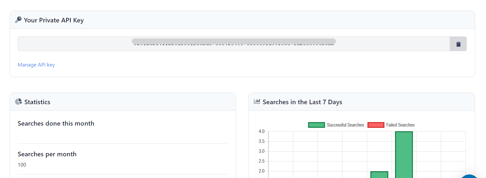

  
  
#  Table of Contents
  
  
- [Table of Contents](#table-of-contents )
- [Overview](#overview )
- [Technology Stack](#technology-stack )
- [Project Information](#project-information )
- [How to use and setup](#how-to-use-and-setup )
  - [Setting up SerpAPI](#setting-up-serpapi )
  - [Setting up the Proxy Server](#setting-up-the-proxy-server )
  - [Basic Macro Setup](#basic-macro-setup )
  - [Advanced Macro Setup](#advanced-macro-setup )
  - [Sample test case files for testing](#sample-test-case-files-for-testing )
  
#  Overview
  
  
Macros are small scripts used to facilitate your day-to-day routine work with different types of documents. ONLYOFFICE macros use the JavaScript syntax and ONLYOFFICE Document Builder API scripting notation.
Using this macro, a user can insert Baidu Search results into the Spreadsheet.
  
#  Technology Stack
  
  
The macro uses a similar syntax to JavaSript. Users without any experience in JavaScript or Programming can also use the Macro, by following this README.
  
#  Project Information
  
  
This Macro uses the API provided by SERPAPI. SERPAPI is ... It provides users with 100 requests per month for free. If you need more requests, you can enroll for one of their paid subscriptions.
There are two versions of the Macro. Basic Version, and the Advanced Version. The right macro for you depends on your usecase.
  
The Basic Macro is recommended for beginners, who only intend to add the Search Results in the spreadsheet for a single query.
  
The Advanced Version provides more control over the request you send, with additonal parameters like no. of results, no. of pages and more. It also allows you to send multiple queries at once.
  
A detailed guide to setting up both the macros can be found below.
  
#  How to use and setup
  
  
Setting up the macro is easy. If you follow all the steps mentioned correctly, you should have no problem running the macro smoothly.
  
##  Setting up SerpAPI
  
  
To use the Baidu Search API provided by SerpAPI, we need to obtain an API Key. To obtain your own API key, head over to [SerpAPI](https://serpapi.com ), and sign up for an account.
After entering all the details and signing up, head over to your personal Dashboard and copy the API Key.

  
##  Setting up the Proxy Server
  
  
To setup the proxy server, you will need to have node and npm pre-installed on your computer. Check out this guide on how to setup Node and npm on your computer depending on the Operating System you are using.
I will also recommend using a code editor like VSCode, for having a better view of the files, and an integrated terminal.
The proxy server runs express on top on Node.js.
To install all the dependancies, run ```npm install``` from the terminal.
  
Once the dependancies are installed, run ```node server.js``` to start the express server.
  
If you get a success message printed in the terminal, your server should now be live on ```PORT 3000```, and you can follow the next steps. If you encounter any error, that means that the server has not started yet. Ensure that you have followed all steps correctly.
  
##  Basic Macro Setup
  
  
After you have successfully setup the Proxy Server, the Basic macro can be setup and ran in a few easy steps.
  
- Copy the contents of basicMacro.js file from this repository.
- Open the Plugins Tab in the Spreadsheet, and click on Macros.
- Paste the contents of the basicMacro.js file and create a new macro. Click 'OK' to save the macro.
- Enter the query you want to search for in the A11 cell. Save the changes.
- Run the macro.
  
##  Advanced Macro Setup
  
  
In order to use the advanced macro version, you will need to follow some additional steps.
  
- Copy the contents of the fmtMacro.js file and create a new macro out of it. Name it accoring to your liking and save it.
- Copy the contents of the advMacro.js file and make a macro out of it. Name it, and save it.
- Run the fmtMacro. You should see something like this.
- Assign the advMacro to the blue shape. This will act as a button, and will run the macro when you click on the shape.
  
Information on the Parameters:
  
- the ```rn``` parameter is to specify the number of results you want. Leave as it is for default behavior.
- the ```pn``` parameter is to specify which page you want the result from. Enter the values in Multiples of 10s, eg: 10 for the first page of results, 30 for the third page, etc. Leave unmodified if you want the default page.
- the ```no_cache``` parameter is to specify whether or not cached data should be used for repititive queries. Enter Y for enabling No Cache functionality, and enter N for disabling it. Leave as it is if you want default behavior.
  
WARNING: Do not empty out any of the 'Parameter' fields. If you dont want to use them, leave them as it is, and don't clear them out. Clearing them out and running the macro will crash the document and the server.
  
##  Sample test case files for testing
  
  
The sampleData.js file in this repository will help you get data for a set query "OSPP", without consuming API requests from SerpAPI. To use this, add this file to the same directory as the proxy server, and change to the URL field in the macro to the '/test' route. Recommended for users who intend to make changes in the macro and test it out.
  